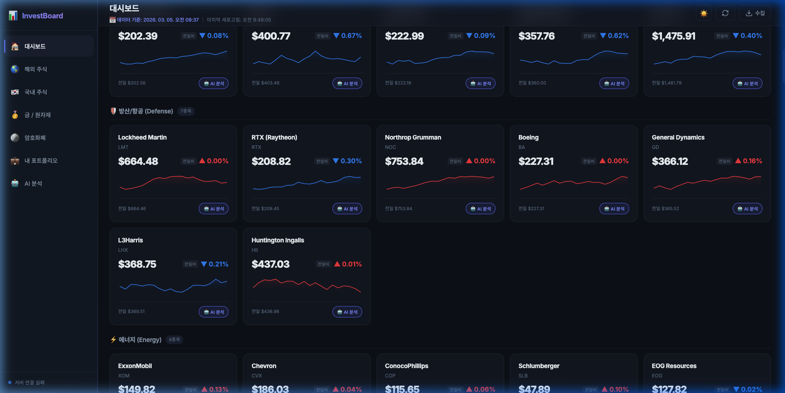
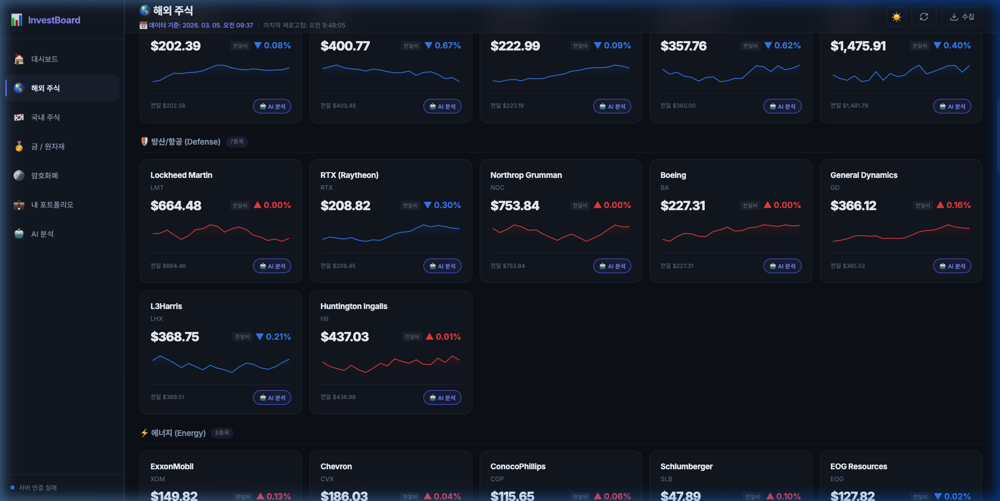
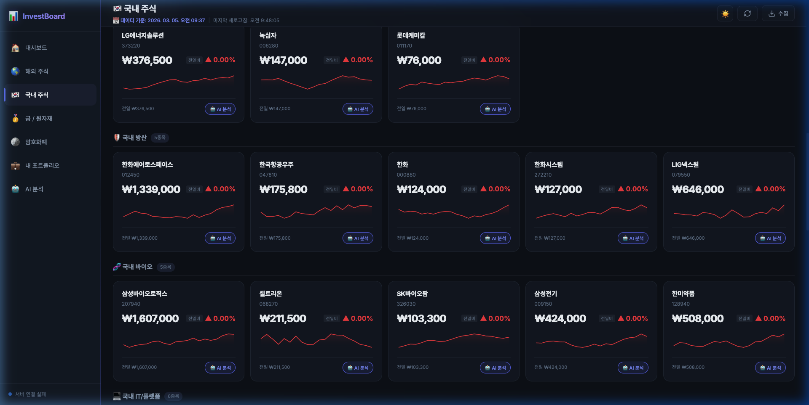
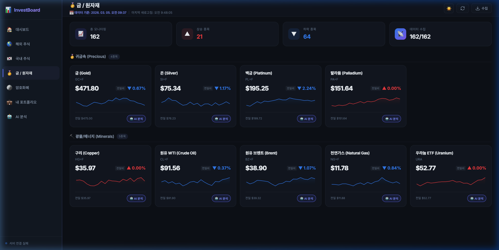
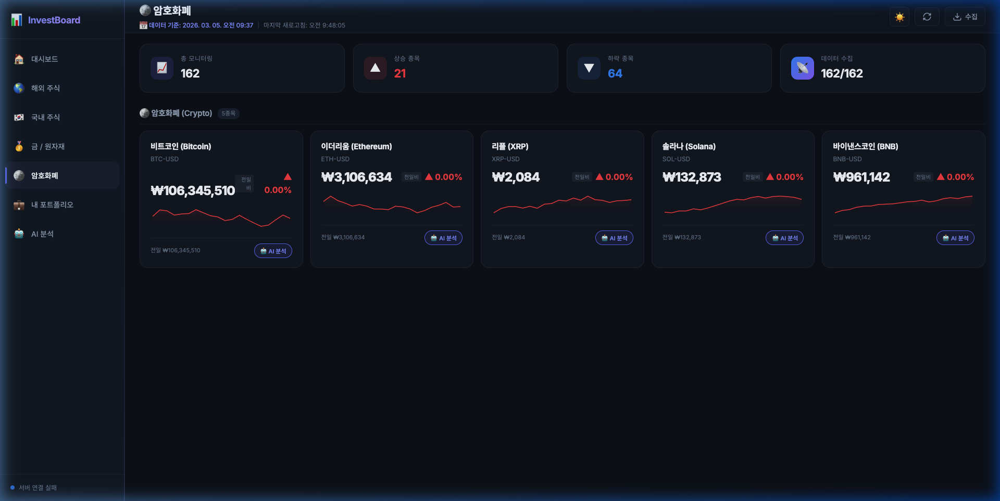
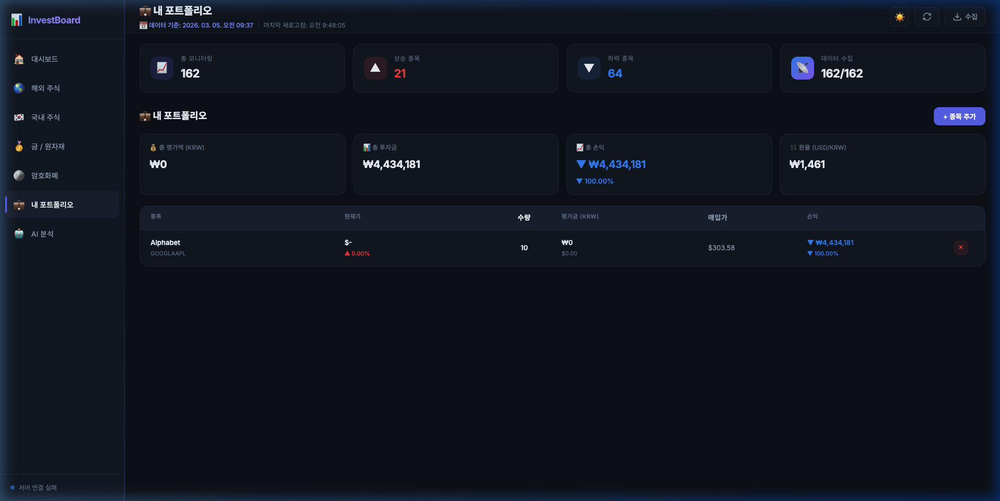

# 📊 InvestBoard — 투자 분석 대시보드

해외 주식, 국내 주식, 금/원자재, 암호화폐 시세를 실시간으로 모니터링하고, Google Gemini AI를 활용한 종목 분석까지 제공하는 올인원 투자 대시보드입니다.

  

---

## ✨ 주요 기능

### 📈 실시간 시세 모니터링
- **해외 주식** — 미국 빅테크, 반도체, 방산, 에너지, 소비재 등 카테고리별 약 90+개 종목
- **국내 주식** — 삼성전자, SK하이닉스 등 시총 상위 55+개 종목 (KRX)
- **금/원자재** — 금, 은, 백금, 원유, 천연가스 등 9+개 상품
- **암호화폐** — 비트코인, 이더리움, XRP, 솔라나, BNB (원화 환산)
- **해외/국내 ETF** — SPY, QQQ, KODEX 200 등 주요 ETF

### 🔍 스마트 필터링
- **시장 필터** — 전체 / 해외 / 국내
- **등락 필터** — 상승 / 하락 / 급등 5%+ / 급락 5%+
- **카테고리 필터** — 기술주, 반도체, 방산, AI, 바이오 등 20+개 카테고리

### 🤖 AI 투자 분석 (Gemini)
- 개별 종목 AI 분석 (매수/매도/관망 추천)
- 전체 포트폴리오 분석
- 3개월 히스토리 기반 기술적 분석

### 💼 포트폴리오 관리
- 종목 추가/삭제 (심볼 또는 기존 종목 선택)
- 매입가/수량 입력 → 총 평가액, 손익, 수익률 자동 계산
- USD/KRW 환율 자동 반영
- LocalStorage 기반 데이터 영구 저장

### 🎨 UI/UX
- 다크 모드 / 라이트 모드 전환
- 미니 스파크라인 차트 (종목별)
- 종목 상세 모달 (차트 + 52주 최고/최저 + 전월비)
- 반응형 레이아웃

---

## 🖥️ 화면 안내

### 1. 대시보드 (메인 화면)



앱을 실행하면 가장 먼저 보이는 **통합 대시보드** 화면입니다.

- **요약 카드 (상단)** — 총 모니터링 종목 수, 상승/하락 종목 수, 데이터 수집 현황을 한눈에 확인
- **필터 바** — 시장(전체/해외/국내), 등락(상승/하락/급등/급락), 카테고리(기술주, 반도체, 방산, AI 등 20+개) 3단계 필터 조합 가능
- **종목 카드 그리드** — 카테고리별로 그룹화된 종목 카드가 테마 헤더와 함께 표시됩니다
- **종목 카드 구성** — 종목명, 심볼, 현재가, 전일비(%), 전월비(%), 미니 스파크라인 차트, 전일 종가, AI 분석 버튼
- **헤더 우측 버튼** — 🌙/☀️ 테마 전환, 🔄 데이터 새로고침, ⬇️ 수집 (서버에서 전체 종목 재수집)

---

### 2. 해외 주식



미국 증시의 **시가총액 상위 약 92개 종목**을 카테고리별로 분류하여 표시합니다.

- **기술주** — Apple, Microsoft, Google, Meta, Oracle, Adobe, SanDisk(WDC) 등
- **반도체** — NVIDIA, TSMC, Broadcom, AMD, Qualcomm 등
- **방산/항공** — Lockheed Martin, RTX, Northrop Grumman, Boeing 등
- **에너지** — ExxonMobil, Chevron, Tesla, NextEra Energy 등
- **소비재/헬스케어/금융/통신/산업재/AI** — 각 섹터별 10개 내외 핵심 종목
- **해외 ETF** — SPY, QQQ, VOO, ARKK, SOXX 등 10개 주요 ETF

각 종목 카드를 클릭하면 **상세 모달**이 열리며, 가격 차트(1W/1M/3M/1Y), 52주 최고/최저, 전월비 등 상세 정보를 확인할 수 있습니다.

---

### 3. 국내 주식



한국 증시(KRX)의 **시가총액 상위 약 55개 종목**을 카테고리별로 표시합니다.

- **대표주** — 삼성전자, SK하이닉스, 현대차, NAVER, 카카오, LG화학 등
- **금융** — 신한지주, KB금융, 하나금융지주, 기업은행 등
- **2차전지/소재** — LG에너지솔루션, 에코프로비엠, 에코프로 등
- **방산** — 한화에어로스페이스, 한국항공우주, 한화시스템, LIG넥스원
- **바이오** — 삼성바이오로직스, 셀트리온, SK바이오팜 등
- **IT/플랫폼** — 크래프톤, 엔씨소프트, 하이브, KT, SK텔레콤 등
- **중공업/소비유통** — 한국조선해양, HD현대중공업, 신세계 등
- **국내 ETF** — TIGER 미국S&P500, KODEX 200, KODEX 미국AI테크TOP10 등

가격은 원화(₩)로 표시되며, 전일비/전월비 모두 확인 가능합니다.

---

### 4. 금 / 원자재



**귀금속과 에너지/광물 원자재** 시세를 실시간으로 추적합니다.

- **귀금속** — 금(Gold), 은(Silver), 백금(Platinum), 팔라듐(Palladium)
- **에너지** — 원유 WTI, 원유 브렌트, 천연가스, 난방유
- **광물** — 구리, 알루미늄, 아연, 우라늄 ETF

가격은 달러($) 기준이며, 서버에서 원화 환산가도 함께 계산합니다.

---

### 5. 암호화폐



**시가총액 상위 5개 주요 코인**의 시세를 **원화(₩)** 기준으로 표시합니다.

- **비트코인 (BTC)** — ₩1억대 실시간 원화 시세
- **이더리움 (ETH)** — ₩300만대 원화 시세
- **리플 (XRP)** — 원화 시세
- **솔라나 (SOL)** — 원화 시세
- **바이낸스코인 (BNB)** — 원화 시세

Yahoo Finance에서 USD 시세를 가져온 후, Google Finance의 실시간 USD/KRW 환율을 적용하여 원화로 자동 변환합니다. 전일 종가, 변동액 등도 모두 원화 기준입니다.

---

### 6. 내 포트폴리오



**개인 투자 포트폴리오**를 관리하는 화면입니다.

- **종목 추가** — 기존 모니터링 종목에서 선택하거나, 심볼(AAPL, 005930.KS 등)을 직접 입력하여 추가
- **매입 정보 입력** — 수량, 매입 단가, 시장(해외 USD / 국내 KRW) 설정
- **포트폴리오 요약** — 총 평가액(KRW), 총 투자금, 총 손익(금액 + %), 환율 표시
- **종목별 현황** — 현재가, 평가액, 손익, 수익률을 종목별로 표시
- **데이터 영구 저장** — LocalStorage에 저장되어 브라우저를 닫아도 유지

---

## 🏗️ 기술 스택

| 구분 | 기술 |
|------|------|
| **프론트엔드** | Vanilla JS, HTML5, CSS3 (커스텀 디자인 시스템) |
| **빌드 도구** | Vite 5 |
| **차트** | Chart.js 4 |
| **백엔드** | Node.js + Express |
| **데이터 소스** | Google Finance (스크래핑), Yahoo Finance v8 API (폴백) |
| **AI 분석** | Google Gemini API |
| **데이터 저장** | 로컬 JSON 파일 (Google Sheets 연동 옵션) |
| **자동화** | node-cron (매일 오전 9시 자동 수집) |
| **개발 도구** | nodemon, concurrently |

---

## 📁 프로젝트 구조

```
invest-dashboard/
├── server/                     # 백엔드 서버
│   ├── index.js                # Express 서버 엔트리포인트
│   ├── routes/
│   │   ├── stocks.js           # 해외/국내 주식 API
│   │   ├── gold.js             # 금/원자재 API
│   │   ├── crypto.js           # 암호화폐 API
│   │   └── analysis.js         # AI 분석 API
│   ├── services/
│   │   ├── yahooFinance.js     # 시세 수집 (Google/Yahoo Finance)
│   │   ├── collector.js        # 데이터 수집 오케스트레이터
│   │   ├── localStorage.js     # 로컬 JSON 파일 스토리지
│   │   ├── llmService.js       # Gemini AI 분석 서비스
│   │   └── googleSheets.js     # Google Sheets 연동 (옵션)
│   └── utils/
│       └── cache.js            # 인메모리 캐시
├── src/                        # 프론트엔드 소스
│   ├── index.html              # 메인 HTML
│   ├── css/
│   │   └── style.css           # 전체 스타일 (다크/라이트 테마)
│   └── js/
│       ├── main.js             # 앱 엔트리포인트
│       ├── dashboard.js        # 대시보드 메인 로직
│       ├── api.js              # API 호출 모듈
│       ├── stockCard.js        # 종목 카드 컴포넌트
│       ├── charts.js           # Chart.js 차트 렌더링
│       └── analysisPanel.js    # AI 분석 패널
├── data/                       # 수집된 데이터 (JSON)
├── .env.example                # 환경변수 예시
├── vite.config.js              # Vite 설정
└── package.json
```

---

## 🚀 빠른 시작

### 1. 클론 & 의존성 설치

```bash
git clone https://github.com/heoquixote/invest-dashboard.git
cd invest-dashboard
npm install
```

### 2. 환경변수 설정

```bash
cp .env.example .env
```

`.env` 파일을 열어 필요한 값을 입력합니다:

```env
# (선택) Gemini AI 분석 기능 사용 시
GEMINI_API_KEY=your_gemini_api_key_here

# (선택) Google Sheets 연동 시
GOOGLE_SHEETS_ID=your_spreadsheet_id_here
GOOGLE_CREDENTIALS_PATH=./credentials/service-account.json

# 서버 포트 (기본: 3001)
PORT=3001
```

> **💡 참고:** `GEMINI_API_KEY` 없이도 시세 모니터링, 포트폴리오 등 핵심 기능은 정상 동작합니다. AI 분석 기능만 비활성화됩니다.

### 3. 실행

```bash
npm run dev
```

- **프론트엔드**: http://localhost:5173
- **백엔드 API**: http://localhost:3001

서버 시작 시 자동으로 전체 종목 데이터를 수집합니다 (약 2분 소요).

---

## 📡 API 엔드포인트

| 메서드 | 경로 | 설명 |
|--------|------|------|
| `GET` | `/api/stocks/overseas` | 해외 주식 시세 |
| `GET` | `/api/stocks/korean` | 국내 주식 시세 |
| `GET` | `/api/stocks/:symbol/history` | 종목 히스토리 (차트용) |
| `GET` | `/api/gold` | 금/원자재 시세 |
| `GET` | `/api/crypto` | 암호화폐 시세 (KRW) |
| `GET` | `/api/exchange-rate` | USD/KRW 환율 |
| `GET` | `/api/health` | 서버 상태 체크 |
| `GET` | `/api/collection-info` | 수집 정보 조회 |
| `POST` | `/api/collect` | 수동 데이터 수집 트리거 |
| `POST` | `/api/analysis/:symbol` | 개별 종목 AI 분석 |
| `POST` | `/api/analysis/portfolio/all` | 전체 포트폴리오 AI 분석 |
| `GET` | `/api/analysis/status` | AI 분석 상태 체크 |

---

## 📊 모니터링 종목

### 해외 주식 (~92개)
| 카테고리 | 대표 종목 |
|----------|-----------|
| 🖥️ 기술주 | AAPL, MSFT, GOOGL, META, WDC(SanDisk) |
| 💾 반도체 | NVDA, TSM, AVGO, AMD, QCOM |
| 🛡️ 방산 | LMT, RTX, NOC, BA |
| ⚡ 에너지 | XOM, CVX, TSLA, NEE |
| 🛒 소비재 | AMZN, WMT, COST, NKE |
| 💊 헬스케어 | UNH, JNJ, LLY, PFE |
| 🏦 금융 | JPM, V, MA, GS |
| 🤖 AI/데이터 | CRM, PLTR, SNOW, DDOG |
| 📊 ETF | SPY, QQQ, VOO, ARKK |

### 국내 주식 (~55개)
| 카테고리 | 대표 종목 |
|----------|-----------|
| 🇰🇷 대표주 | 삼성전자, SK하이닉스, 현대차, NAVER |
| 🔋 2차전지 | LG에너지솔루션, 에코프로비엠 |
| 🛡️ 방산 | 한화에어로스페이스, 한국항공우주 |
| 🧬 바이오 | 삼성바이오로직스, 셀트리온 |

### 🪙 암호화폐 (5개, 원화 표시)
| 코인 | 심볼 |
|------|------|
| 비트코인 | BTC-USD |
| 이더리움 | ETH-USD |
| 리플 | XRP-USD |
| 솔라나 | SOL-USD |
| BNB | BNB-USD |

### 🥇 금/원자재 (9+개)
금, 은, 백금, 팔라듐, 원유(WTI/브렌트), 천연가스, 구리, 우라늄 ETF

---

## ⚙️ 데이터 수집 방식

```
Google Finance (주요 소스)
    ↓ 실패 시
Yahoo Finance v8 API (폴백)
```

- **Google Finance**: HTML 스크래핑으로 실시간 시세 + 전일비 추출
- **Yahoo Finance**: REST API v8 차트 엔드포인트로 시세 + 히스토리 조회
- **암호화폐**: Yahoo Finance 우선 (Google Finance에서 코인 미지원)
- **환율**: Google Finance USD-KRW 실시간 조회

### 자동 수집 스케줄
| 시점 | 동작 |
|------|------|
| 서버 시작 시 | 전체 종목 즉시 수집 |
| 매일 오전 9시 | 전일 종가 자동 수집 (cron) |
| 수동 트리거 | 대시보드 "수집" 버튼 클릭 |

---

## 🔧 스크립트

```bash
npm run dev         # 서버 + 클라이언트 동시 실행 (개발)
npm run dev:server  # 서버만 실행 (nodemon)
npm run dev:client  # 클라이언트만 실행 (Vite)
npm run build       # 프로덕션 빌드
npm start           # 프로덕션 서버 실행
```

---

## 🔑 Gemini API 키 발급 (선택)

AI 분석 기능을 사용하려면 Google Gemini API 키가 필요합니다:

1. [Google AI Studio](https://aistudio.google.com/apikey)에서 API 키 발급
2. `.env` 파일에 `GEMINI_API_KEY=발급받은_키` 입력
3. 서버 재시작

---

## 📝 라이선스

MIT License
